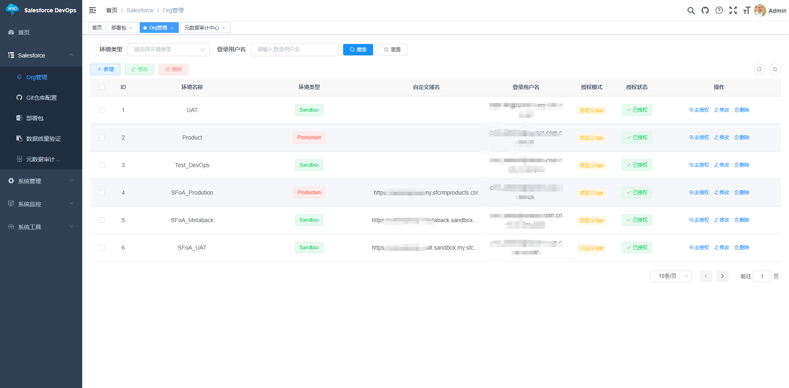
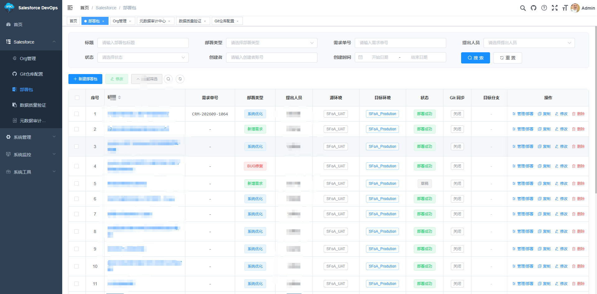
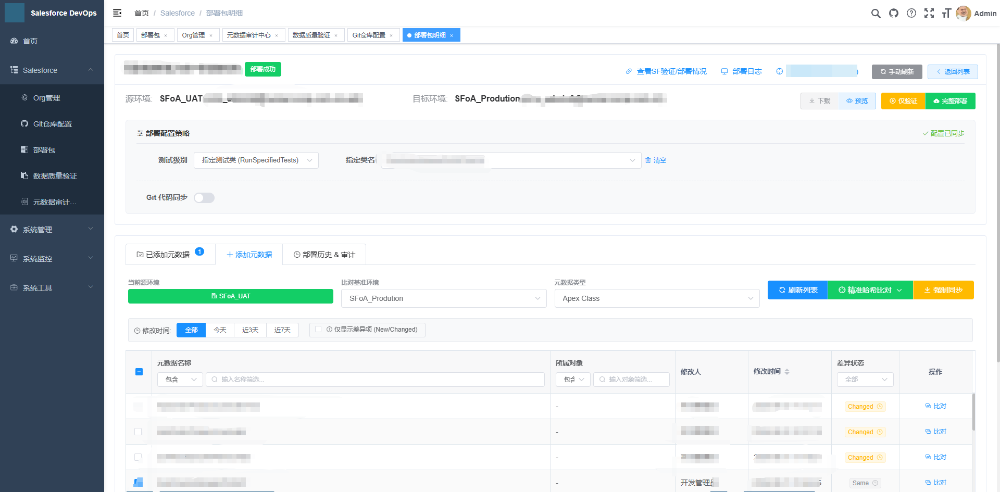
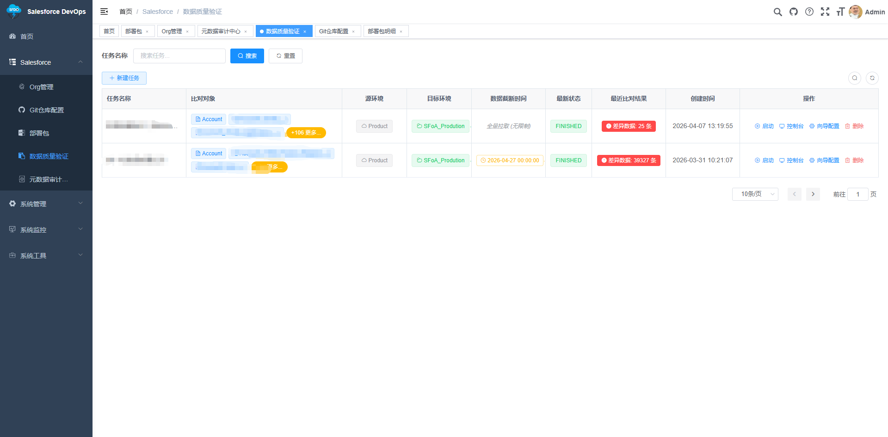

<p align="center">
	
</p>
<h1 align="center" style="margin: 30px 0 30px; font-weight: bold;">Salesforce DevOps Platform</h1>
<h4 align="center">基于 RuoYi-Vue 构建的 Salesforce 元数据部署 + 数据质量比对平台</h4>
<p align="center">
	<a href="https://gitee.com/y_project/RuoYi-Vue"></a>
	<a href="https://spring.io/projects/spring-boot"></a>
	<a href="https://www.oracle.com/java/"></a>
	<a href="https://opensource.org/licenses/MIT"></a>
</p>

---

## 一、项目简介

本项目是面向 **Salesforce 项目实施与运维团队** 的一站式 DevOps 工具，用于解决两大核心痛点：

1. **元数据跨环境部署** —— 在 Dev / UAT / Sandbox / Production 之间安全地迁移 Apex、LWC、对象、权限等元数据，
   支持部署前差异比对、部署前自动备份、一键回滚、以及部署结果自动同步到 Git 仓库。
2. **迁移后数据质量验证** —— 针对 SFoA（Salesforce on Anywhere）等历史数据迁移场景，
   提供跨 Org 的大数据量「源端 vs 目标端」逐行比对能力，快速定位缺失行、字段值不一致等迁移缺陷。

整个平台构建在 **[RuoYi-Vue](https://gitee.com/y_project/RuoYi-Vue)** 快速开发框架之上，
复用了其权限体系、代码生成器、定时任务、监控告警等基础设施，并在此基础上实现了完整的 Salesforce 业务能力。

---

## 二、核心功能

### 2.1 Salesforce 环境管理（Org）

- 基于 **OAuth 2.0 Web Server Flow** 完成 Org 授权，获取 `refresh_token` 后长期免登录。
- 管理多套环境（Production / Sandbox / Developer），记录实例地址、自定义域名、Connected App 凭证。
- 一键测试连通性，自动刷新短期 `access_token`。
- 内置 **元数据浏览器**，可在线查看目标 Org 的对象、字段、Apex 类等元数据清单。

### 2.2 元数据部署（Deploy）

- **部署包（Deployment）** 概念：将一组元数据成员打包为一次原子发布，支持需求单号、需求责任人、
  部署类型等业务字段，便于审计追溯。
- 通过 **Metadata API** 生成 `package.xml` 并执行部署，支持三种测试级别：
  - `NoTestRun`（仅 Sandbox 允许）
  - `RunLocalTests`
  - `RunSpecifiedTests`（可指定测试类清单）
- **部署前差异比对**：调用 `describeMetadata` / `listMetadata` 解析源端与目标端元数据，
  自动标记每个成员的状态为 `New` / `Changed` / `Same` / `Invalid`，避免无效部署。
- **部署前自动备份**：从目标环境 `retrieve` 出完整源码并打包落盘，作为回滚基线。
- **一键回滚**：基于历史备份包，将目标环境还原到部署前状态。（虽有这个回滚功能但使用较少，不推荐使用，需回滚请自行再次部署）
- **异步进度实时推送**：基于 WebSocket（`/websocket/{sid}`）把 Salesforce 异步任务状态、
  部署日志实时推送到前端控制台，无需轮询。

### 2.3 GitOps 自动化（Git 同步）

- 使用 **JGit** 实现无本地 Git 客户端依赖的代码同步：
  克隆目标分支 → 解压部署包 → 智能识别 Salesforce DX（`force-app/main/default`）或
  传统 `src/` 目录结构 → `git add` → 生成规范 Commit → 推送远程。
- Commit Message 遵循 Conventional Commits 规范，自动带上需求单号与部署类型。
- **智能跳过空提交**：推送前检查 `status.isClean()`，仓库无变化或被 `.gitignore` 忽略时不产生噪音提交。
- Git 访问令牌使用 **AES 加密存储**（`sf_git_config.credentials`），接口返回时自动脱敏。
- 支持 GitLab / GitHub Personal Access Token 鉴权。

### 2.4 数据质量比对（Reconcile）

针对迁移后的数据校验场景，实现了工业级的大数据量比对引擎：

- **两阶段比对**：先通过 Salesforce **Bulk API 2.0** 将源端与目标端数据异步导出为 CSV，
  再在本地进行流式碰撞比对，避开 API 单次返回条数与内存限制。
- **外部归并排序 + 双指针归并连接**：对超过内存容量的文件做外排后归并比对，
  可稳定处理百万级记录的比对任务。
- **字段级差异定位**：精确到「哪个对象的哪一行的哪个字段」不一致，输出差异明细文件供下载。
- **字段映射**：支持源端 / 目标端字段名不一致的映射配置，以及排除字段清单。
- **SOQL 过滤与数据截止时间**：可配置 `WHERE` 条件，并支持「仅比对该时间点之前的数据」，
  规避迁移期间增量数据造成的误报。
- **并发控制**：可配置同时比对的对象数量上限，避免打爆 Org 的 API 调用限额。
- **实时进度监控**：对象级进度（`WAITING` / `RUNNING` / `FINISHED` / `FAILED`）通过 WebSocket 推送。

### 2.5 平台能力（来自 RuoYi 框架）

用户 / 部门 / 岗位 / 角色 / 菜单 / 字典 / 参数管理，操作日志、登录日志、在线用户、
定时任务（Quartz）、代码生成器、接口文档（Swagger）、服务与缓存监控、Druid 连接池监控。

### 2.6 多租户隔离（SaaS）

- 基于 MyBatis-Plus `TenantLineInnerInterceptor`，对 `sf_` 前缀表以及
  `sys_user` / `sys_dept` / `sys_role` 自动追加 `tenant_id = ?` 条件。
- `TenantAutoFillInterceptor` 在 INSERT 时通过反射自动填充 `tenantId`，业务代码无需关心。
- 超级管理员（`admin`）默认绕过租户隔离，可跨租户运维。
- 默认租户编号：**`000000`**。

---

## 三、界面预览

> 截图取自项目实际运行界面，示例数据均已脱敏。

<table>
	<tr>
		<td width="100%" align="center">
			<br>
			<sub>① 环境管理（Org）：多套环境接入、授权状态与 Connected App 配置</sub>
		</td>
	</tr>
	<tr>
		<td width="100%" align="center">
			<br>
			<sub>② 部署包列表：按需求单号 / 部署类型 / 环境检索，集中管理部署、回滚与 Git 同步</sub>
		</td>
	</tr>
	<tr>
		<td width="100%" align="center">
			<br>
			<sub>③ 部署包明细：部署配置策略、与目标环境的元数据差异比对（New / Changed / Same）</sub>
		</td>
	</tr>
	<tr>
		<td width="100%" align="center">
			<br>
			<sub>④ 数据质量验证：跨 Org 数据比对任务、实时进度与差异条数概览</sub>
		</td>
	</tr>
</table>

> **维护说明**：截图统一存放在 `doc/images/`，按 `NN-<页面>.png` 命名（`NN` 为展示序号）。
> 新增截图时，复制上面任意一个 `<tr>` 块、改成新的 `src` 与 `<sub>` 说明即可；
> 若希望每行并排两张，把 `<td>` 与 `` 的 `width` 一并改为 `50%`。

---

## 四、技术栈

| 分类 | 技术 |
| --- | --- |
| 后端框架 | Spring Boot 2.5.15、Spring Security、JWT、Redis |
| ORM | MyBatis + **MyBatis-Plus 3.5.3.1**（多租户、逻辑删除、乐观锁） |
| 数据库 | MySQL 5.7+ / 8.0+ |
| 定时任务 | Quartz |
| Salesforce SDK | `force-wsc` / `force-metadata-api` / `force-partner-api` **58.0.0** |
| Salesforce API | Metadata API、Bulk API 2.0、REST Describe API、OAuth 2.0 |
| GitOps | **JGit 5.13.3** |
| 工具库 | Hutool、Commons-IO、java-diff-utils |
| 前端 | Vue 2、Element UI、Vuex、Vue Router、Axios、Monaco Editor |
| 实时通信 | WebSocket（原生 `@ServerEndpoint`） |

---

## 五、项目结构

```text
RuoYi-Vue/
├── ruoyi-admin/            # 启动模块，承载 application.yml / application-druid.yml
├── ruoyi-common/           # 通用工具、注解、常量、异常
├── ruoyi-framework/        # 框架核心：Security、多租户拦截器、数据源、WebSocket 配置
├── ruoyi-system/           # 系统管理模块（用户/角色/菜单/字典等）
├── ruoyi-quartz/           # 定时任务
├── ruoyi-generator/        # 代码生成器
├── ruoyi-salesforce/       # ★ 本项目的核心业务模块
│   └── src/main/java/com/ruoyi/salesforce/
│       ├── controller/     # 13 个 REST 控制器
│       ├── service/        # 业务服务（部署、回滚、备份、比对、Git 同步…）
│       ├── domain/         # 实体与 VO
│       ├── mapper/         # MyBatis-Plus Mapper
│       └── websocket/      # 部署/比对进度推送
├── ruoyi-ui/               # ★ Vue 前端
│   └── src/views/salesforce/
│       ├── org/            # 环境管理 + 元数据浏览器
│       ├── deployment/     # 部署包列表 / 详情 / 构建控制台 / Diff 查看器
│       ├── reconcile/      # 比对任务向导 / 监控 / 结果预览 / 字段映射
│       ├── audit/          # 部署历史与备份包审计
│       └── gitConfig/      # Git 仓库凭证配置
├── doc/
│   ├── images/             # ★ README 演示截图（NN-<页面>.png）
│   └── 若依环境使用手册.docx
└── sql/
    ├── ry_20250522.sql         # RuoYi 原始脚本（保留，未改动）
    ├── quartz.sql              # Quartz 调度表原始脚本（已整合进 sf_devops_init.sql）
    └── sf_devops_init.sql      # ★ 本项目完整初始化脚本（40 张表 + 菜单 + 字典）
```

### Salesforce 业务表一览

| 表名 | 说明 |
| --- | --- |
| `sf_org` | Salesforce 环境（Org）与授权凭证 |
| `sf_deployment` | 部署包主表 |
| `sf_deployment_item` | 部署包元数据明细 |
| `sf_deployment_history` | 部署历史记录（含 Git 同步状态） |
| `sf_deployment_history_detail` | 部署历史 Diff 快照 |
| `sf_git_config` | Git 仓库配置（凭证 AES 加密） |
| `sf_data_job` | 数据比对任务 |
| `sf_data_obj_config` | 比对对象与字段映射配置 |
| `sf_data_run_log` | 比对执行日志（任务级） |
| `sf_data_run_obj_log` | 比对执行日志（对象级，含进度） |

---

## 六、快速开始

### 6.1 环境要求

- JDK 1.8+
- MySQL 5.7+ / 8.0+
- Redis 5+
- Maven 3.6+
- Node.js 12+ / 14+（推荐 14 LTS）

### 6.2 初始化数据库

```bash
# 创建数据库
CREATE DATABASE sf_devops DEFAULT CHARACTER SET utf8mb4 COLLATE utf8mb4_general_ci;

# 执行完整初始化脚本（含 RuoYi 基础表 + Salesforce 业务表 + Quartz 调度表 + 菜单 + 字典）
mysql -u root -p sf_devops < sql/sf_devops_init.sql
```

> `sql/sf_devops_init.sql` 已整合 `quartz.sql` 的全部调度表，**无需再单独执行 `quartz.sql`**。
> 共创建 40 张表：19 张 RuoYi 基础表 + 10 张 Salesforce 业务表 + 11 张 Quartz 调度表。
> 原 `sql/ry_20250522.sql` 保留未改动，仅作参考。

默认账号：

| 账号 | 密码 | 角色 | 说明 |
| --- | --- | --- | --- |
| `admin` | `admin123` | 超级管理员 | 拥有全部权限，绕过租户隔离 |
| `sfdev` | `admin123` | 普通角色 | 已授权 Salesforce 运维菜单 |

> ⚠️ 两个账号的密码均为框架默认值，**部署到任何可访问的环境前请立即修改**。

### 6.3 修改配置

编辑 `ruoyi-admin/src/main/resources/application-druid.yml`，填写你自己的数据库地址与账号密码：

```yaml
master:
    url: jdbc:mysql://localhost:3306/sf_devops?...
    username: your_db_user
    password: your_db_password
```

编辑 `ruoyi-admin/src/main/resources/application.yml`：

```yaml
ruoyi:
  profile: /home/sf-devops/uploadPath   # Windows 本地开发改为 D:/ruoyi/uploadPath
  salesforce:
    callbackUrl: http://localhost:8080/system/sf/callback
    frontendUrl: http://localhost
    clientId: your-salesforce-client-id         # ← 替换为你的 Connected App Consumer Key
    clientSecret: your-salesforce-client-secret # ← 替换为你的 Consumer Secret
    GIT_AES_KEY: ChangeMeAesKey16               # ← 必须恰好 16 个字符
```

同时确认 Redis 配置（`spring.redis.host` / `port` / `password`）与你的环境一致。

### 6.4 配置 Salesforce Connected App

在 Salesforce 后台 **Setup → App Manager → New Connected App**：

1. 勾选 **Enable OAuth Settings**。
2. **Callback URL** 填写 `http://localhost:8080/system/sf/callback`（线上改为你的域名）。
3. **Selected OAuth Scopes** 至少勾选：
   - `Manage user data via APIs (api)`
   - `Perform requests at any time (refresh_token, offline_access)`
4. 保存后获取 **Consumer Key** 与 **Consumer Secret**，填入 `application.yml`。
5. 若目标环境开启了 IP 限制，请把你的服务器出口 IP 加入 **Trusted IP Ranges**。

### 6.5 启动后端

```bash
# 在项目根目录
mvn clean package -DskipTests

# 运行（开发模式）
java -jar ruoyi-admin/target/ruoyi-admin.jar
```

后端默认监听 `http://localhost:8080`。

### 6.6 启动前端

```bash
cd ruoyi-ui
npm install --registry=https://registry.npmmirror.com
npm run dev
```

前端默认监听 `http://localhost:80`，浏览器打开后使用 `admin / admin123` 登录。

### 6.7 首次使用流程

1. **环境管理** → 新增 Org，填写 Connected App 凭证 → 点击「授权」跳转 Salesforce 登录 → 授权后自动回填 `refresh_token`。
2. **Git 配置** → 填写仓库地址与 Personal Access Token → 点击「测试连接」验证 → 保存。
3. **部署管理** → 新建部署包 → 选择源 / 目标环境 → 同步元数据清单 → 标记要部署的成员 → 执行校验 / 部署。
4. **数据比对** → 新建比对任务 → 添加要比对的对象与字段映射 → 执行 → 在监控页查看实时进度 → 下载差异明细。

---

## 七、⚠️ 已知限制与待完善事项

> 本节如实记录当前代码中**尚未完成或存在缺陷**的部分，便于后续迭代与二次开发。
> 欢迎提交 PR 共同完善。

### 7.1 Git 自动合并（autoMerge）尚未实现 —— 仅有界面占位

这是当前最明显的一处**功能未闭环**：

- `sf_deployment` 表已有 `auto_merge` 字段，部署列表页与详情页均有
  **「部署成功后合并至主分支」** 复选框（见 `ruoyi-ui/src/views/salesforce/deployment/index.vue`、
  `detail.vue`）。
- 但后端**完全没有对应的实现逻辑**。全项目 JGit 相关引用仅有
  `CloneCommand` / `Git` / `LsRemoteCommand` / `PersonIdent` / `UsernamePasswordCredentialsProvider`，
  **不存在 `MergeCommand`、`checkout`、以及合并后的二次 push**。
- 也就是说：勾选该选项不会产生任何实际效果，部署包只会被推送到 `target_branch`，不会被合并到主分支。

**补全思路**：在 `SfGitSyncService.syncToGit()` 推送成功后，读取 `deployment.getAutoMerge()`，
若为 `1`，则 `git.checkout().setName("master")` → `git.merge().include(commit)` → 再次 `push` 到主分支，
并把合并结果写入 `sf_deployment_history.git_sync_log`。

### 7.2 Git 同步的其他缺陷

| 问题 | 位置 | 说明 |
| --- | --- | --- |
| 删除的元数据不会被同步 | `SfGitSyncService.java` | `git.add().addFilepattern(".")` 未加 `.setUpdate(true)`，只暂存新增/修改，**不暂存删除**。从 Org 删除的 Apex 类不会在 Git 中删除。 |
| SSH 鉴权不支持 | `SfGitConfigServiceImpl.java` | `authType` 虽支持 `SSH` 取值，但实际只构造了 `UsernamePasswordCredentialsProvider`，SSH 私钥方式未实现。 |
| WebSocket 状态硬编码 | `SfGitSyncService.sendLog()` | 无论成功失败，推送的 `status` 恒为 `"Succeeded"`，Git 失败时前端仍显示成功态。 |
| Git 状态未在前端展示 | `SfAuditVo` / `audit/index.vue` | `sf_deployment_history` 的 `git_commit_hash` / `git_sync_status` / `git_sync_log` 三列已写入数据库，但 `SfAuditVo` 未定义对应字段，Mapper 查询结果被静默丢弃，前端页面看不到。 |

### 7.3 权限控制未落地

- `ruoyi-salesforce` 模块下 **所有 Controller 均未添加 `@PreAuthorize` 注解**，
  任何已登录用户都能调用全部业务接口。
- 前端 `ruoyi-ui/src/views/salesforce/**` 下 **没有任何 `v-hasPermi` 指令**，按钮级权限未生效。
- 本次已在初始化脚本中**预置了完整的权限标识**（如 `salesforce:deployment:deploy`、
  `salesforce:org:remove` 等，菜单 ID `2000`–`2054`），后续只需在 Controller 上补注解即可启用。
- **安全提示**：`/system/sf/**` 路径在 `SecurityConfig` 中被配置为 `permitAll()`，
  意味着 Salesforce 授权回调和元数据接口可被匿名访问，请评估是否收窄为需认证访问。

### 7.4 其他待办

- `SfGitConfigController` 的 `/save` 接口无条件用当前登录用户的 `tenantId` 覆盖入参，
  在跨租户运维场景下存在租户归属被改写的风险。
- `ruoyi-salesforce` 模块内存在部分未使用的页面组件（如 `reconcile/preview.vue`），
  可清理以减少维护成本。
- 暂未提供单元测试与集成测试。

---

## 八、安全须知

1. **严禁将真实密钥提交到版本库。** 仓库中的 `application.yml` / `application-druid.yml`
   已全部替换为占位值；真实值请放在本地 `local-secrets/` 目录（已在 `.gitignore` 中排除）。
2. **`GIT_AES_KEY` 长度必须为 16 个字符**，否则 `SfGitConfigServiceImpl.initAes()` 会回退到内置默认密钥，
   导致密文无法正确解密。生产环境请通过环境变量或配置中心注入。
3. **上线前请修改**：数据库密码、Druid 控制台密码（`login-password`）、`admin` / `sfdev` 账号密码、
   `token.secret`（JWT 签名密钥）。
4. **若密钥曾经被推送过**：仅删除文件不足以清除痕迹，历史提交中仍可检索到。
   请务必轮换 Salesforce Connected App 凭证、数据库密码、Git Token，必要时使用
   `git filter-repo` / BFG 重写历史。
5. 建议在生产环境关闭 `swagger.enabled`，并将 `spring.devtools.restart.enabled` 设为 `false`。

### ⚠️ 免责声明

> **本工具会直接改动 Salesforce 生产环境的元数据，请务必谨慎使用。**

- **使用本工具即表示你已充分理解并自行承担相关风险。** 作者与贡献者不对因使用本工具
  而产生的任何直接或间接损失负责，包括但不限于：元数据被意外覆盖、生产环境配置被篡改、
  权限体系被变更、数据丢失或业务中断。
- **用于正式环境之前，请务必先在测试环境进行综合测试。**
  建议在一个完整的 Sandbox 中至少覆盖以下场景后，再考虑接入生产：
  部署成功 / 部署失败 / 部分成功 / 回滚 / Git 同步 / 含 `Delete` 动作的部署 /
  大批量元数据触达 API 限额的场景。
- **部署前请预览部署包的内容。**
  请在部署详情页逐一确认元数据清单（类型、名称、`Add` / `Delete` 动作）与目标环境是否相符。
  尤其留意 `Delete` 动作，以及 `Profile`、`PermissionSet`、`SharingRules` 这类
  **高风险元数据** —— 它们的部署可能覆盖目标环境已有的权限与共享配置。
- 建议为生产环境部署配置**独立的 Salesforce 账号与最小必要权限**，并在每次部署前
  确认 `sf_deployment_history` 中已生成备份包，作为回滚基线。

---

## 九、二次开发与开源协议

- 本项目基于 **[RuoYi-Vue](https://gitee.com/y_project/RuoYi-Vue)** v3.9.1 构建，
  遵循 **MIT** 开源协议，保留原框架的版权与许可声明。
- Salesforce 业务模块（`ruoyi-salesforce`）及对应前端页面为二次开发内容。
- 使用本项目时，请遵守 Salesforce 官方的 API 调用限额与使用条款。
- 文档参考：
  - RuoYi 官方文档：<http://doc.ruoyi.vip>
  - Salesforce Metadata API：<https://developer.salesforce.com/docs/atlas.en-us.api_meta.meta/api_meta/>
  - Salesforce Bulk API 2.0：<https://developer.salesforce.com/docs/atlas.en-us.api_asynch.meta/api_asynch/>

---

## 十、致谢

感谢 [RuoYi](https://gitee.com/y_project/RuoYi-Vue) 开源项目提供的优秀基础框架。


